# NYC Yellow Taxi Cab Data Fullstack (Angular + Springboot) Cloud Deployment (Azure)

This project is live rn and till my Azure credits run out or I build something else lol go check it out at https://dhruvdattani.info

```
Internet
   │
   ▼
Domain (dhruvdattani.info)
   │
DNS A Record
   │
   ▼
Azure Public IP
   │
   ▼
VM (Docker Compose)
   │
   └── Nginx container (ports 80/443, reverse proxy + TLS)
           │
           ├── Angular container (static files)
           │
           └── Spring Boot API container
                       │
                       ▼
           Azure PostgreSQL Flexible Server
```

So this project is just something I wanted to build to show my skills in SQL, REST Apis, Azure, Springboot (JAVA) and Angular.

Its a cloud-based analytics dashboard built using real NYC taxi data from:

For this project, since I'm on a budget the dataset is just scoped to January 2025, realistically I could add more data, but Jan alone had 3.5 million trips to give perspective.

https://www.nyc.gov/site/tlc/about/tlc-trip-record-data.page

Based of the resources from above ^ I designed the DB schema, loaded the data into PostgreSQL, and exposed it through a Spring Boot API using JPA/Hibernate for efficient querying

The frontend is Angular and provides filtering pagination and an analytics dahsboard to visualize metrics like revenue, trip, counts, zones, etc. Emphasis here but Trip data is displated in descending order (most recent first) just to prioritize relevance.

I containerized this whole system with Docker and orchestrated it with Docker Compose. Nginx served as my rev proxy and handeled HTTPs via certbot. 

The stack was deployed to an Azure VM with my custom domain along with a managed PostgreSQL Flexible Server, to make my application publicly available.


## Data Overview

So again I used the official NYC Yellow Taxi dataset here scoped to just January for demo purposes.

First part was just building a data ingestion pipeline using Python and Pandas to convert raw Parquet file into CSV. And do any cleaning that needed to be done. Then just bulk loaded that data in to Postgres.

I tried my best to use a normalized schema. The db is "nyc_yellow_taxi_db" along with a dedicated "yellow_taxi_user" that owns the schema and the tables. And I have 5 tables in that DB:

1. payment_types
2. rate_codes
3. taxi_zones
4. vendors
5. yellow_tripdata

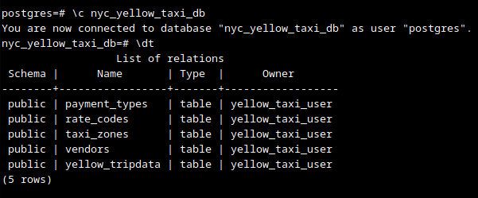

First 4 are lookup tables with their static reference data. Primary keys were established on all the lookup tables and then used as references by the main "yellow_tripdata" table. Had foreign key relation ships mapping rows in "yellow_tripdata" to each reference table forming many-to-one relationships from trips to lookup tables and one-to-many from lookup tables to the trips.

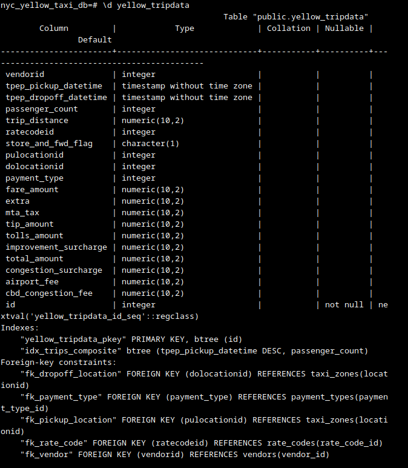


## Backend (SpringBoot API) Overview

Backend is pretty straight forward was built using SpringBoot and follows a typical REST archictecture. The structure basically starts by exposing all endpoitn under /api/*. Which allows the frontend to retrieve trip data, lookup data, and analytics. Architecture goes: Controllers (HTTP layer) -> Services (business logic) -> Respositories (data access), and DTOs (response shaping)

I had 3 main controller groups:

1. Trips
2. Lookups (vendor, payment_type, zones)
3. Analytics

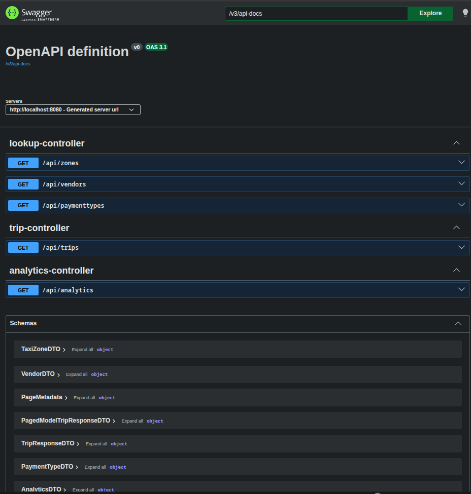

### TripController

This handles /api/trips and is responsible for retrieving paginated and filterd trip records, sorted by most recent trisp first.

I decided to use JPA Specifications here to allow dynamic query construction, and only adding preidcates if query params are provided, like data-range, passsengers, payment type, etc.

Flow:

```
HTTP Request (/api/trips)
        ↓
TripController
        ↓
TripService
        ↓
JPA Specification (dynamic predicates)
        ↓
YellowTripDataRepository.findAll(spec, pageable)
        ↓
Page<YellowTripData>
        ↓
TripMapper → DTO
        ↓
ResponseEntity<Page<TripResponseDTO>>
```

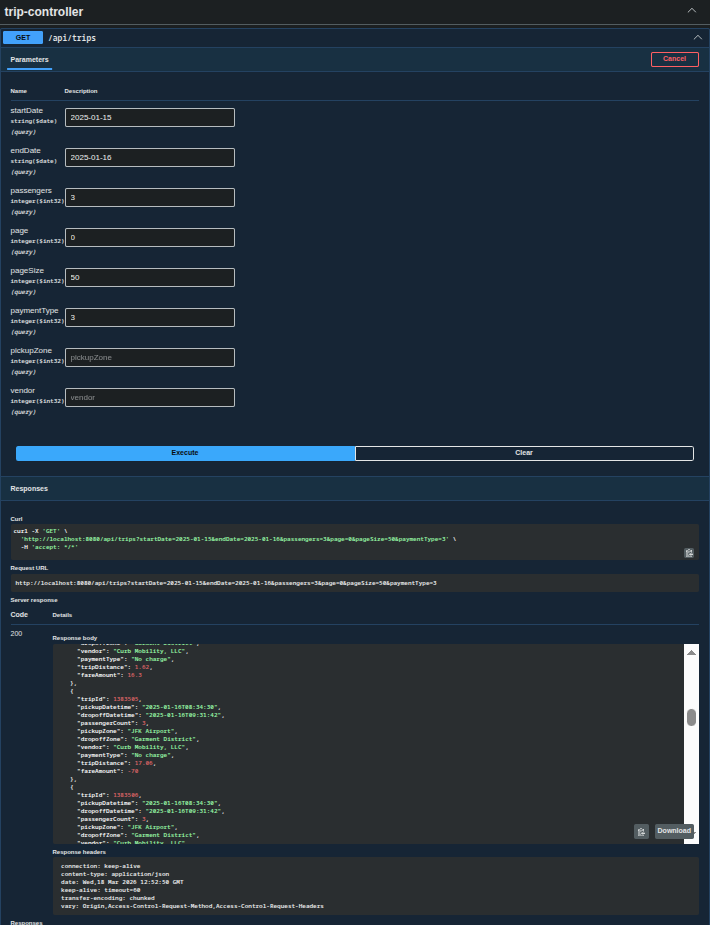


### AnalyticsController

This one handles /api/analytics and returns aggregated metrics like total trips, revenue, averages and top catagories like payment methods.

So skipped repositories here and used the Entity Manager with CriteriaBuilder to contstruct multiple aggregations like COUNT, AVG, SUM, GROUP BY.

Flow:

```
HTTP Request (/api/analytics)
        ↓
AnalyticsController
        ↓
AnalyticsService
        ↓
EntityManager
        ↓
CriteriaBuilder (3 queries)
   ├── Aggregates (COUNT, AVG, SUM)
   ├── Top Pickup Zone (GROUP BY + ORDER)
   └── Top Payment Type (GROUP BY + ORDER)
        ↓
Raw Results (Object[])
        ↓
Mapped to AnalyticsDTO
        ↓
ResponseEntity<AnalyticsDTO>
```

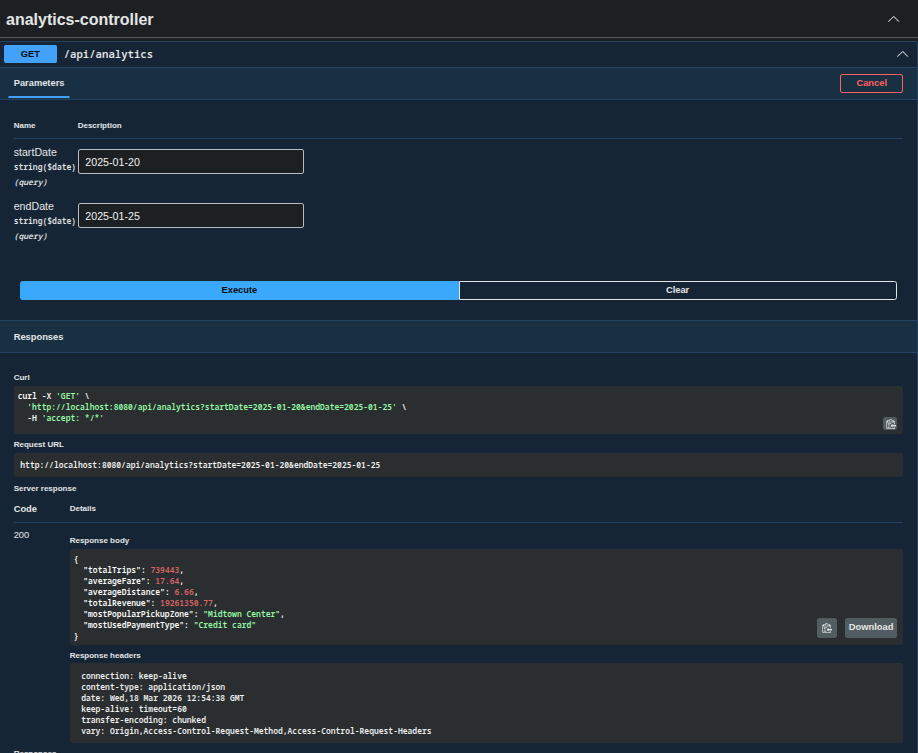


### LookupController

This would handle endpoints like /api/paymenttypes, /api/vendors and /api/zones to return the reference data need in my frontends drop downs.

Went back to that same repository query flow like "findAll" and "custom finder" and just mapped my entities to the DTOs to skip all the circular relationship limbo that I was running in to.

Flow:

```
HTTP Request (/api/vendors, /paymenttypes, /zones)
        ↓
LookupController
        ↓
LookupService
        ↓
Repository (findAll / findByBorough)
        ↓
List<Entity>
        ↓
Stream → Mapper → DTO
        ↓
ResponseEntity<List<DTO>>
```

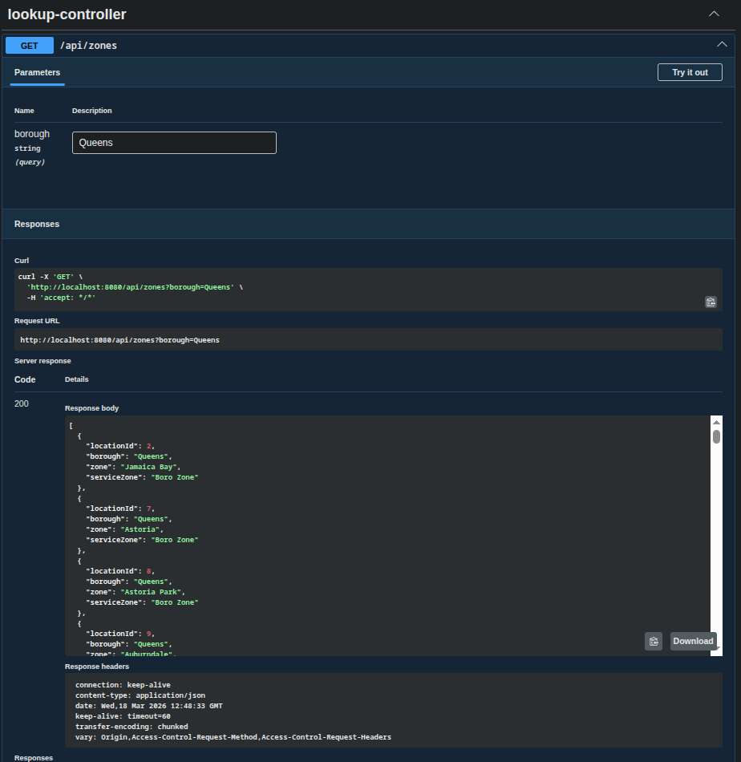


### Packaging and Deployment

I wanted to build out a CI/CD for this but just eneded up running out of time. But naturally just packaged the backend into a JAR using Maven locally, then built a Docker image, my Dockerfile basically just built the image with the JAR in my targets folder. The image is deployed via docker-comose on my Azure VM along with the frontend image. Basically made my api an contianerized service and put it behind Nginx like a typical production env.


## Frontend (Angular) Overview

The frontned is built using Angular and consumes from the Spring Boot REST API to provide an analytics dashboard where you can filter by pickup date, and a trips page that provides a table list of trips based on pickupdate range, and other filters. Both of these use reactive forms and RxJS-based data flows.

I have one centralized api service that handles all the HTTP com with the backend, and puts each all in to a reusable method to return strongly typed Observables via the shared models I created.

### Trips Page

This is the more complicated one, but it basically allows users to explore trip-level data with filtering, pagination and lookup components.

Page is initialized using ngOnInit lifecycle hook. This is where the reactive form is generated and the lookup data for the drop downs is fecthed.

The reactive form captures filters like pickup date range, passengers, payment type, pickup zone, vendor and page size.

So its using a BehaviorSubject + SwitchMap -> reactive request handling pattern.

One thing to note is that the template is just binding directly to the observable returned by the API using an aync pipe rendering the data and changes in the UI. For both of these I was running into a problem just using observables because components were not unsubscribing and so thats just handled automatically now. 

Flow:

```
ngOnInit()
   ↓
Initialize Form + Load Lookups
   ↓
Setup trips$ Observable (BehaviorSubject → switchMap)
   ↓
User Input (Filters / Pagination)
   ↓
BehaviorSubject.next(params)
   ↓
ApiService.getTrips(params)
   ↓
Async Pipe → Table Render
```

#### UI Overview
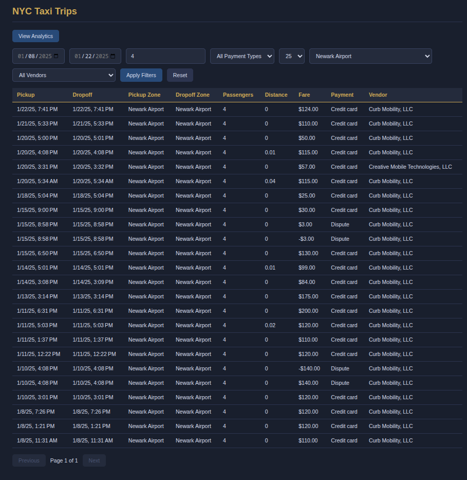
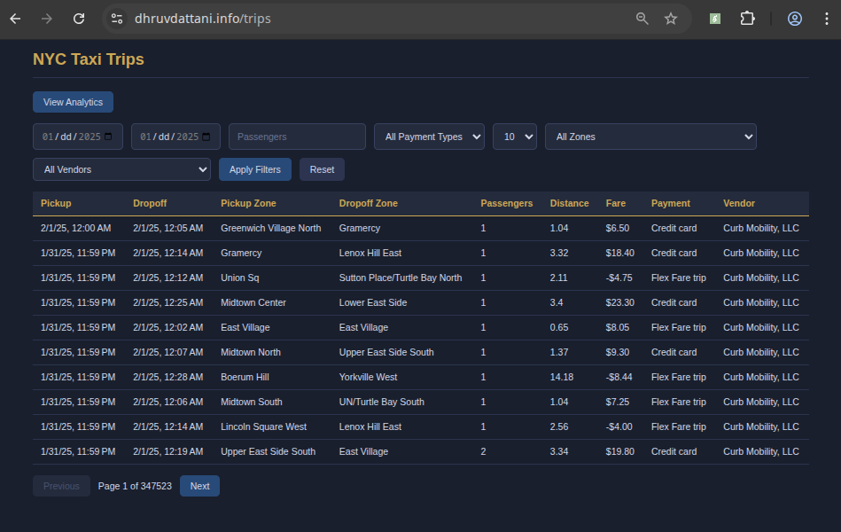

#### API Calls (Network Layer)
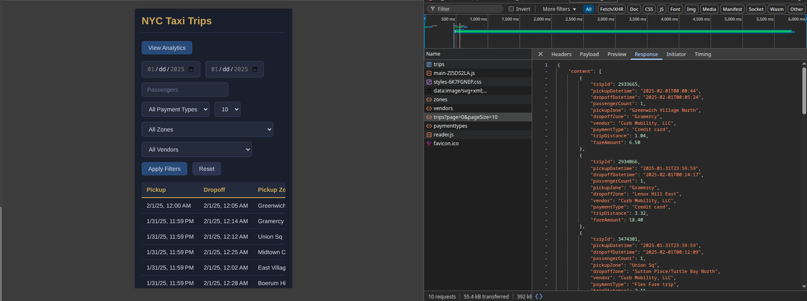


### Analytics Page

This page is a lightweight KPI sort of dahsboard that just displays aggregated metrics like total trips, revenue, and averages.

This is a simpler reactive form theres only pickup date fitlers but same pattern. BehaviorSubject holds the params, switchMap triggers the API calls, and then async pipe renders results.

Flow:

```
ngOnInit()
   ↓
Initialize Form
   ↓
Setup analytics$ Observable
   ↓
Initial Fetch (empty params)
   ↓
User Applies Filters
   ↓
BehaviorSubject.next(params)
   ↓
ApiService.getAnalytics(params)
   ↓
Async Pipe → KPI Cards Render
```

#### UI Overview
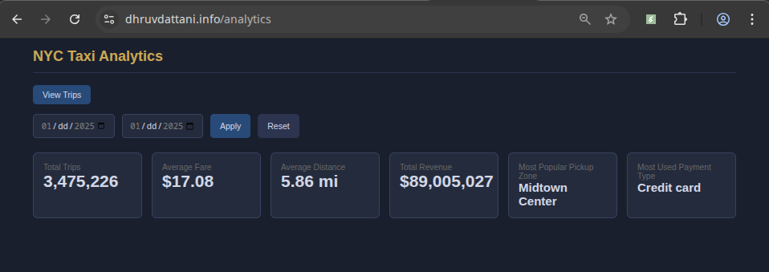
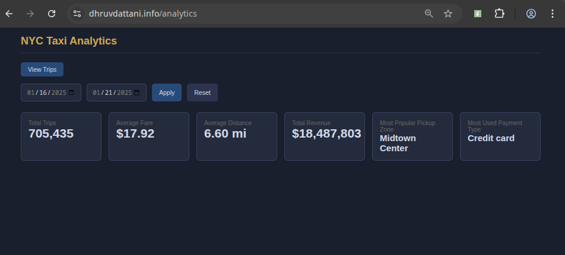

#### API Calls (Network Layer)
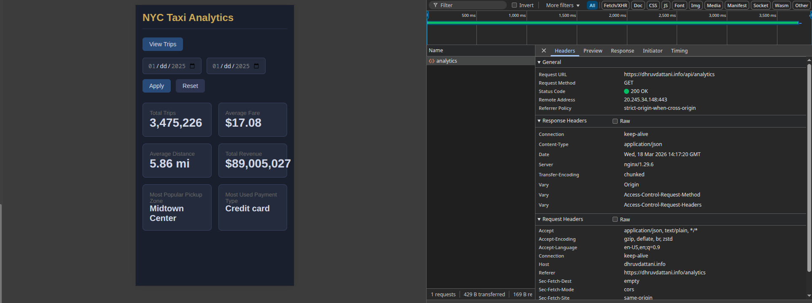


### Notes and Reflection

1. I used ngOnInit to initalize the forms, data streams and initial API calls

2. Used ngOnDestroy in the Trips component to clean up manual subs to observables

3. Used reactive forms overall

4. RxJS with the BehaviorSubject + switchMap architecture. This just helped cancel any stale requests and prevent overlapping API calls.

5. Async pipe for automatic sub management

6. Stuck all my APi calls in a shared service layer with typed models

### Packaging and Deployment

The frontend is in Angular and it uses a multi-stage Docker build to optimize image size. The first section a node based imagis used to install deps and then run ng build turning everything into static files.

Then the second stage is just an nginx image from which Angular apps are typicall served and its just throwing those static files in to where nginx expects them in order to serve.

Then again everything is thrown in to docker compose and deployed to Azure.

## Orchestration and Azure Infra/Deployment and NGINX details

This application is deployed using a containerized arhcitecutre and orchestrated with docker compose on an Azure VM.

### Azure Infra

All resources were provisioned inside a resource group in Azure in the West US region. Primarily because my Azure subscription tier 1 only allowed resources that I need to be sprung up in this region. Like this is where everything lined up.

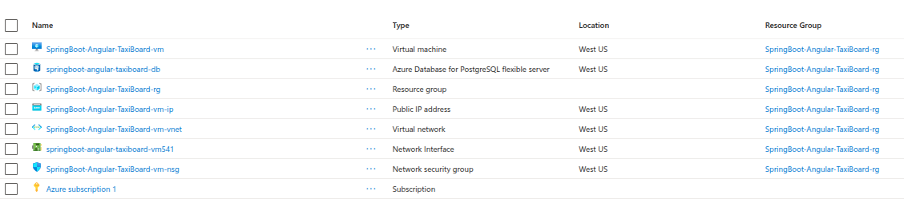


#### Azure VM

Loaded this up with Rocky Linux 9, set it up with ssh so I could get in set everything up manually.

#### Networking

For this just had a VNET and subnet created with the creation of my VM. Made sure my VM had a public static IP assigned. Then the NSG (network security group) is just configured to allow SSH and HTTP along with HTTPS, ports 22, 80, and 443 respectively.

#### Database

Database was just an Azure PostgreSQL Flexible Server. Essentially the cheapest thing I could get that was also sufficient and not incredibly slow for demo purposes. I restricted access to solely my Azure VM's ip and my fedora workstation and Mac. Had to make sure that "sslmode=require" was used when either accessed the DB.

#### Domain & DNS

I had an existing custom domain dhruvdattani.info and decided to use that instead of buying one. Just had to configure the A records to point to the VMs ip.

#### Containerization & Images

Built both images locally and then pushed them to docker hub so that the VM could just grab from there. And it does it anyways via Docker Compose, since they're uploaded to a public repo.

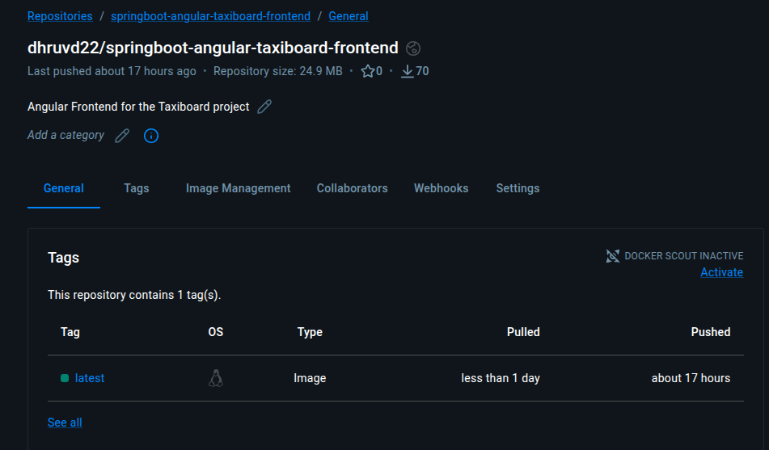
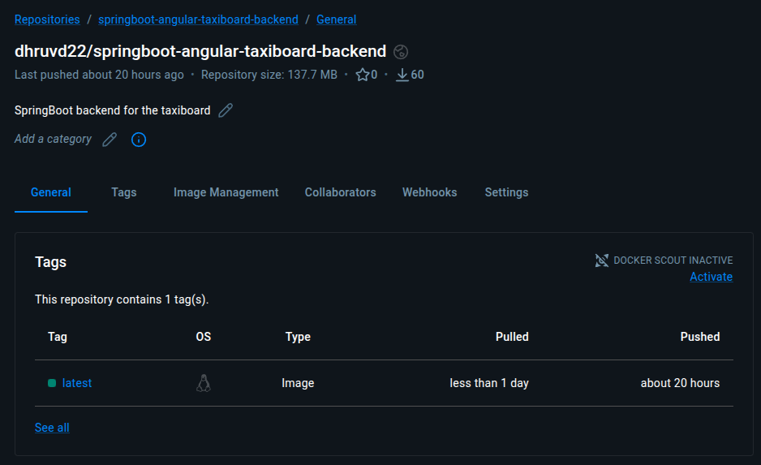

### Docker Compose & Orchestration

Had 4 services working together:

1. backend
2. frontend
3. nginx (rev proxy + TLS term)
4. certbot + certbot-renew (to automate ssl cert managmenet)

Then there was a shared network bridge running to make sure everything can talk internally.

Key point backend never gets exposed to the internet. All traffic goes throug nginx first, and I had a .env file with my DB creds to inject at runtime.

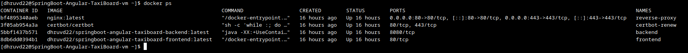


### Nginx Rev Proxy & Routing & HTTPS with Certbot

So "/" routes to the frontend, "/api/" routes to the backend. Nginx was my entrypoint and handled all the routing and TLS termination logic.

The certbot is inside a container and gets integrated with nginx. Port 80 handled my ACME challenge requests. Certbot generated the certs and stored them in shared volumes. Then nginx used those certs for SSL term. Theres a separate certbot-renew container that runs every 12 hours to auto renew the certs

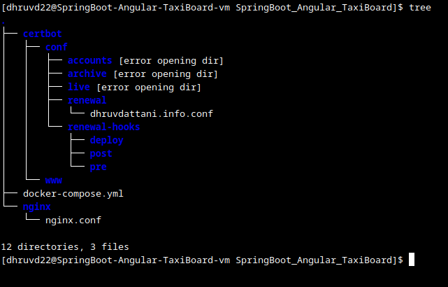


